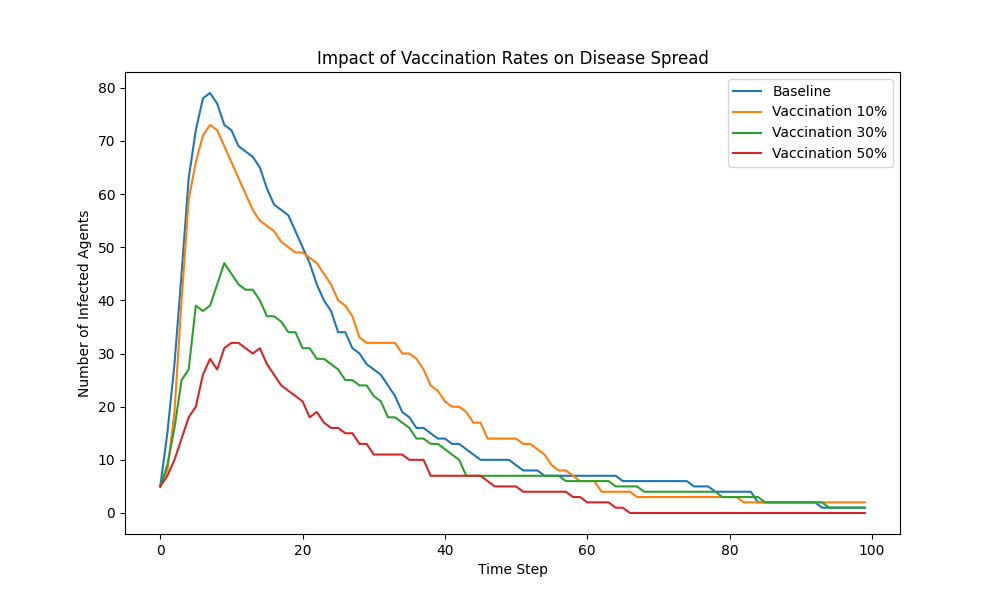
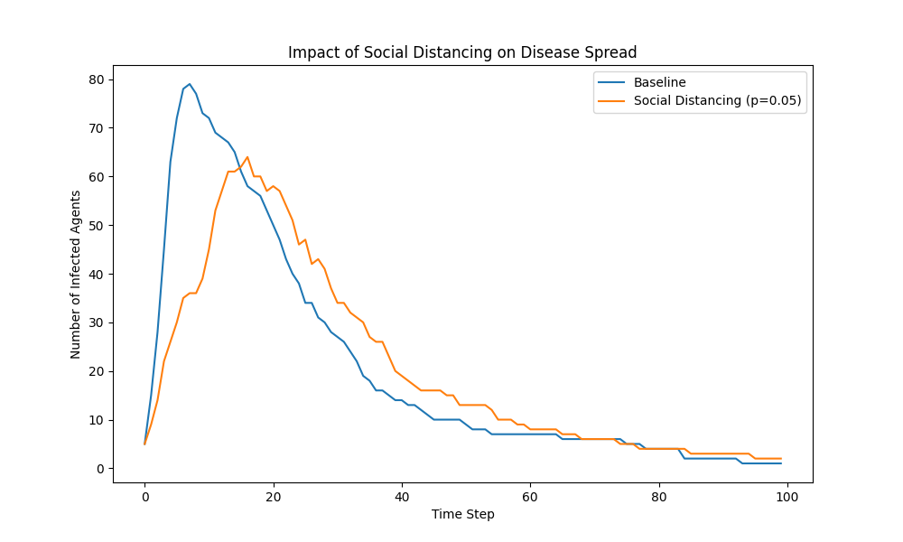
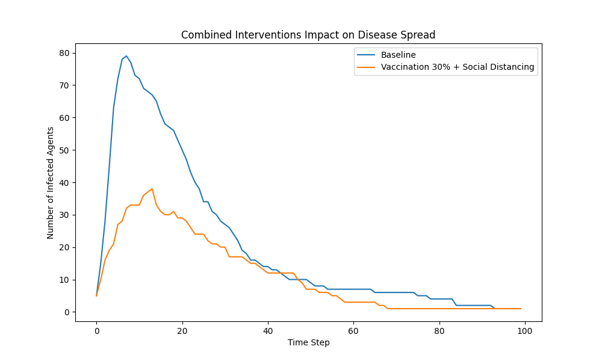

# Findings

This document summarizes the key findings from the simulation experiments conducted using the agent-based epidemic model.

## Experiment Setup

- **Baseline Parameters**
  - `num_agents`: 100
  - `initial_infected`: 5
  - `transmission_prob`: 0.1
  - `recovery_prob`: 0.05
  - `vaccination_rate`: 0.0
  - `max_steps`: 100

- **Intervention Scenarios**
  - **Vaccination Rates**: 0%, 10%, 30%, 50%
  - **Social Distancing Levels**: Adjusting `p` in the network graph from 0.1 to 0.05

## Results

### 1. Baseline Scenario (No Interventions)

- **Outcome**
  - Rapid increase in infected agents, peaking around step 10
  - Eventually, all agents become either infected or recovered.
- **Insights**
  - Without interventions, the disease spreads quickly through the entire population.

### 2. Impact of Vaccination

#### Vaccination Rate at 10%

- **Outcome**
  - Slight reduction in peak infected agents.
  - Slower spread compared to baseline.
- **Insights**
  - Even a small vaccination rate can have a noticeable impact on disease spread.

#### Vaccination Rate at 30%

- **Outcome**
  - Significant reduction in peak infected agents.
  - The epidemic curve flattens.
- **Insights**
  - Higher vaccination rates contribute to herd immunity, protecting unvaccinated individuals.

#### Vaccination Rate at 50%

- **Outcome**
  - Even more reduction in peak infected agents
  - Curve flattens out more
- **Insights**
  - Didn't quite cross a critical vaccination threshold that could prevent an outbreak, but still and improvement.

### 3. Impact of Social Distancing

#### Reduced Network Connectivity (`p = 0.05`)

- **Outcome**
  - Slower disease spread.
  - Lower peak number of infected agents.
- **Insights**
  - Social distancing effectively reduces transmission by limiting contacts.

### 4. Combined Interventions

- **Vaccination at 30% and Social Distancing (`p = 0.05`)**

  - **Outcome**
    - The disease spread is minimal.
    - Outbreak is contained early.
  - **Insights**
    - Combining interventions has a synergistic effect, greatly enhancing control measures.

## Graphical Results

### Impact of Vaccination Rates on Disease Spread

### Impact of Social Distancing on Disease Spread

### Combined Interventions Impact on Disease Spread

## Conclusions

- **Vaccination is Highly Effective**
  - Increasing vaccination rates leads to a substantial decrease in disease spread.
  - Herd immunity thresholds are evident in the simulation results.

- **Social Distancing Reduces Transmission**
  - Lowering the average number of contacts slows down the epidemic.
  - Effective as a temporary measure, especially when vaccines are not available.

- **Combined Strategies Offer Best Results**
  - Implementing both vaccination and social distancing provides optimal control.
  - Policy measures should consider multi-faceted approaches.

## Recommendations

- **Policy Implementation**
  - Aim for high vaccination coverage to achieve herd immunity.
  - Implement social distancing during outbreaks to reduce peak healthcare demand.

- **Model Extensions**
  - Incorporate more realistic social networks (e.g., scale-free networks).
  - Add demographic variables to study differential impacts.

## Limitations

- The model simplifies many real-world complexities.
- Results are indicative but should be validated with empirical data.

